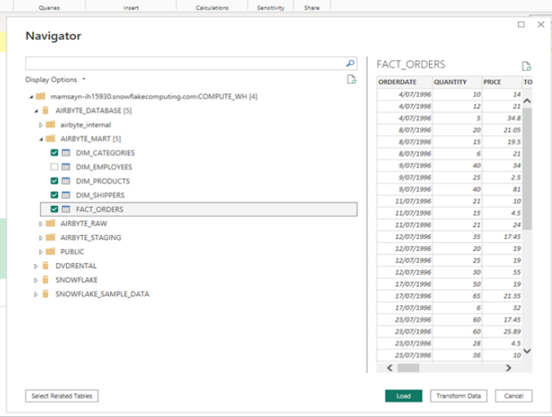

# DEB2024 - Seal Team 6 - Project 3

| Authors     | Danny Bui, Deepti Bist, GWong |
| ---         | ---                           |
|Submission   | 8th Apr 2024                  |
|Data Source  | Northwind Sample DB           |

# Project Context and Goals

Provide the CEO of Northwind insights on 
- Customers,
- Products,
- Revenue, 
- Product movement geographically

# Solution Architecture

# Presentation

[Presentation/README.md](Presentation/README.md)

# Airbyte Cloud

- Setup source

- Setup destination

- Incremental update

# Snowflake x dbt Lab

## Tests

## DBT Setup

# Data Modelling

The snowflake schema:

# Power BI

See contents of the PowerBI folder to inspect the .pbix file.

